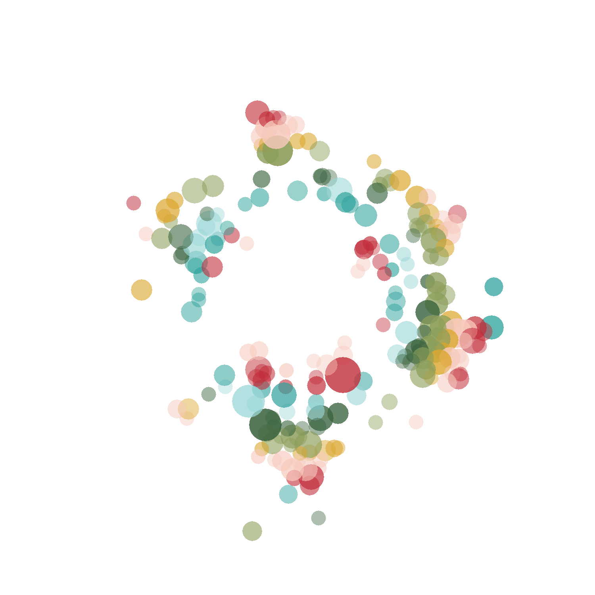

```{r setup, include=FALSE}
knitr::opts_chunk$set(echo = TRUE)
```


### [Manky Parrots](https://tinyurl.com/MankyParrots)

::: {.floating}

```{r echo = FALSE, out.width='30%', out.extra='style="float:right; padding:10px"'}
knitr::include_graphics("images/mp_logo.png")
```

Manky Parrots is a citizen science project that aims to map the incidence of 
psittacine beak and feather disease (PBFD) in Australia. Collecting records of 
the locations and movements of infected birds is a step towards understanding 
the spread of this disease in the wild. Visible signs of infection include 
deformation of the beak, claws and feathers. Sightings can be logged 
[here](https://tinyurl.com/MankyParrots), and if you'd like more information 
about this project, please get in contact at MankyParrot@gmail.com.

:::


### [feathers](https://github.com/shandiya/feathers)

::: {.floating}

```{r echo = FALSE, out.width='30%', out.extra='style="float:right; padding:10px"'}

```

`feathers` is an R package that contains colour palettes inspired by the plumage of Australian birds. For species exhibiting sexual dimorphism (i.e. males and females look different), I have used female colours. Research on birds has historically been biased towards males, and the choice to use female colours in this package is my way of highlighting the often-overlooked beauty of female birds.

:::


### [rtistry](https://github.com/shandiya/twirly-whirly)

::: {.floating}

```{r echo = FALSE, out.width='30%', out.extra='style="float:right; padding:10px"'}
knitr::include_graphics("images/tw_1.png")
```

Sometimes I make art in R. These are often posted on [Twitter](https://twitter.com/ShandiyaB) and tagged `#rtistry`. If you're interested in the code that creates these images, it can be found on [GitHub](https://github.com/shandiya) in a few different repositories. 

:::


