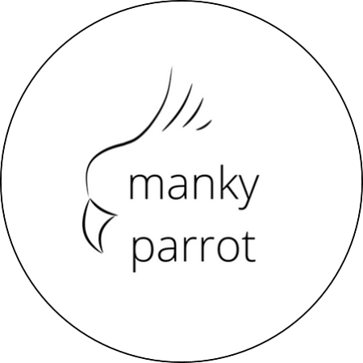
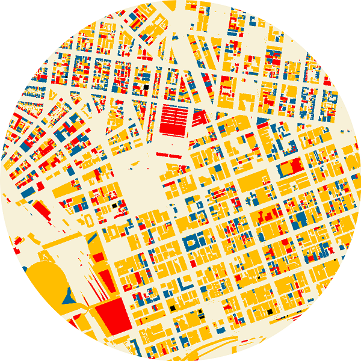

```{r setup, include=FALSE}
knitr::opts_chunk$set(echo = TRUE)
```

```{css, echo=FALSE}

h1, h3, p {
  text-align: left;
}

```

::: {.floating}

```{r echo = FALSE, out.width='30%', out.extra='style="float:right; padding:10px"'}

```

### [Manky Parrots](https://tinyurl.com/MankyParrots)

Manky Parrots is a citizen science project that aims to map the incidence of 
psittacine beak and feather disease (PBFD) in Australia, to better understand 
the spread of this disease in the wild. Visible signs of infection include 
deformation of the beak, claws and feathers. Sightings can be logged 
[here](https://tinyurl.com/MankyParrots), and if you'd like more information 
about this project, please get in contact at MankyParrot@gmail.com.

:::


::: {.floating}

```{r echo = FALSE, out.width='30%', out.extra='style="float:right; padding:10px"'}

```

### [feathers](https://github.com/shandiya/feathers)

`feathers` is an R package that contains colour palettes inspired by the plumage of Australian birds. For species exhibiting sexual dimorphism (i.e. males and females look different), I have used female colours. Research on birds has historically been biased towards males, and the choice to use female colours in this package is my way of highlighting the often-overlooked beauty of female birds.

:::


::: {.floating}

```{r echo = FALSE, out.width='30%', out.extra='style="float:right; padding:10px"'}
knitr::include_graphics("images/tw_1.png")
```

### [rtistry](https://github.com/shandiya/twirly-whirly)

Sometimes I make art in R, and sometimes I post it on [Twitter](https://twitter.com/ShandiyaB) with the `#rtistry` tag. If you're interested in the code behind the images, you can find it on [GitHub](https://github.com/shandiya).

:::


::: {.floating}

```{r echo = FALSE, out.width='30%', out.extra='style="float:right; padding:10px"'}

```
 
### [30DayMapChallenge](https://github.com/shandiya/30DayMapChallenge)   
 
The `#30DayMapChallenge` was initiated by [Topi 
Tjukanov](https://github.com/tjukanovt/30DayMapChallenge) in November 2019. 
My contributions to the 2021 challenge are [here](https://github.com/shandiya/30DayMapChallenge).   

:::
